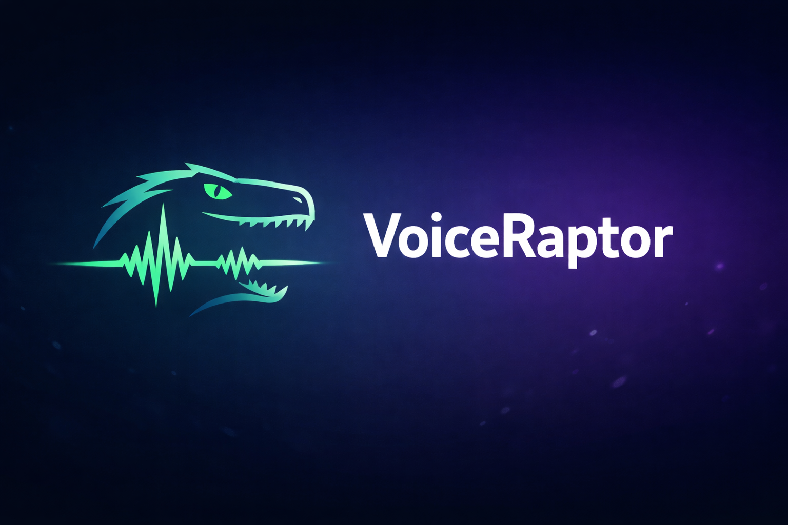

# Voice raptor

*Designed for clarity, speed, and privacy.*

Start 🎤🎧🚀: https://alexander-topilskii.github.io/VoiceRaptor/

## 🌟 Key Features

### 🎙️ Professional Audio Capture
*   **High-Quality WAV**: Records directly to 16-bit PCM WAV format, ensuring uncompressed, broadcast-ready audio quality.
*   **Client-Side Encoding**: Audio processing happens entirely in the browser. No audio data is ever sent to a server.
*   **Background Stability**: Optimized to continue recording even when the device screen is off (on supported devices) or via the Wake Lock API to keep the screen alive.

### 📊 Advanced Visualization
*   **Real-Time Spectrum Analyzer**: A responsive, gradient-based frequency visualizer that reacts instantly to audio input.
*   **Amplitude History (Mini-Map)**: A scrolling top bar that visualizes the entire recording session's waveform, making it easy to navigate long recordings.
*   **Visual Feedback**: Dynamic color shifts (Cyan for normal levels, Rose for peaks) provide immediate visual feedback on input gain.

### 🚩 Marker System
*   **Live Tagging**: Press the **Flag** button or hit the **'M'** key during recording to drop a time-stamped marker.
*   **WAV CUE Support**: Markers are embedded into the WAV file header as `cue` chunks, compatible with professional audio editors like Adobe Audition and Oceanaudio.
*   **Editable Metadata**: Rename markers and recordings directly within the app interface.

### 💾 Local-First Architecture
*   **IndexedDB Storage**: Recordings are saved to the browser's persistent database (IndexedDB), allowing for large file storage without memory limits.
*   **Offline Capability**: The app functions 100% offline.
*   **Data Privacy**: Your data lives on your device. Clearing the browser cache will remove recordings, so export important files!

### 📱 Progressive Web App (PWA)
*   **Installable**: Can be installed as a native-like application on iOS, Android, and Desktop.
*   **Offline Mode**: A Service Worker caches assets, ensuring the app loads instantly even without an internet connection.
*   **Responsive Design**: A fluid, dark-themed UI that adapts perfectly from mobile phones to large desktop screens.

## 🛠️ Technical Stack

*   **Frontend**: React 18, TypeScript, Vite
*   **Styling**: Tailwind CSS, Lucide React (Icons)
*   **Audio**: Web Audio API (ScriptProcessorNode for raw PCM access)
*   **Storage**: IndexedDB
*   **APIs**:
    *   `Navigator.mediaDevices` (Audio capture)
    *   `Screen Wake Lock API` (Prevent sleep)
    *   `Web Share API` (Native sharing)

## ⌨️ Shortcuts

*   **M**: Add a marker instantly during recording or playback.
*   **Space**: (Native browser behavior) usually toggles active buttons.

## 🚀 Getting Started

1.  **Grant Permissions**: Allow microphone access when prompted.
2.  **Record**: Tap the Microphone button.
3.  **Mark**: Tap "Flag" or press 'M' to mark interesting moments.
4.  **Save**: Stop the recording to save it to the local library.
5.  **Export**: Click the Download icon to get the `.wav` file, or Share to send it to other apps.

## ⚠️ Data Persistence Warning

VoiceRaptor stores data in your browser's **IndexedDB**.
*   **Do not use Incognito/Private mode** if you want to keep recordings.
*   **Clearing browser cache/data** will delete your recordings.
*   Always **Download/Export** critical recordings to your device's file system.

---
